# Carlos Pinedo

Frontend Engineer focused on React, TypeScript, frontend architecture and scalable user interfaces.

I work on production web and mobile products involving complex state, GraphQL integrations, design systems, performance, and WebView-based experiences.

Currently interested in AI-assisted engineering workflows, advanced React architecture, interactive UI and frontend infrastructure.

---

## Main stack

React · TypeScript · Next.js · Redux · GraphQL · Tailwind · SCSS · Jest · Cypress · Vercel

Also worked with D3, Highcharts, eCharts, Kendo UI, Adyen integrations, i18n, design systems and mobile WebView wrappers.

---

## Selected work

### Marta Pinedo

Professional law firm website built with Next.js and TypeScript.

- SEO-oriented architecture
- Responsive UI
- Internationalization support
- Performance-focused implementation

https://www.martapinedoabogada.es

---

## Activity

  

---

## Contact

- GitHub: @carlosnumber9
- LinkedIn: https://www.linkedin.com/in/carlos-pinedo-sanchez
